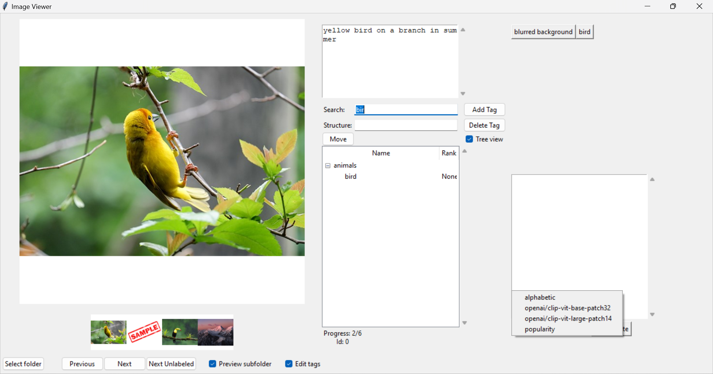

## An annotation tool for image-text pair labelling

It is a tkinter app with utils for tags reuse, and recommendation using out of the box multimodal models.

### Support
Was tested on Windows 10/11 with 1920x1080 screen.

### Features
The annotations are stored as json file.
They can be accessed from the session json file (your_folder_name.json) as `root["data"]`.
It has a structure of  
`{file_path:{  
"prompt": str,  
"tags": [...]  
}}`
The file is updated almost upon every interaction with the app.

**Interaction**
1) The working directory is selected through `Select Folder` button.
Images in the directories are then retrieved via rglob and sorted by absolute path.
2) `Ctrl + left/right` to show next image.
3) Press `Esc` to focus on tag search bar.
4) While focused on search bar, press `Up/Down` to select a tag from the list below.
5) Toggle `Edit tags` to turn tags into buttons. Press on them to remove the tag from the list of labels.
6) Specify the path in the structure to add tags to the pool in folders.
7) Press `Return` while in search bar or structure bar to add the tag to the pool.
8) Press `Ctrl + Return` to add the tag to the pool and assign to the image.
9) To select tag from the pool, double-click on it or focus and press `Return`.
10) Focus on a tag from the pool, update the structure value and press `Move` button above to move between folders.
11) Select a recommendation method from the drop-down list on the right below.
When models are selected, they are going to be used as feature extractors for image and tags. The ui will freeze while loading.
12) Press `Recompute` to the right from recommendation method to reload/recompute embeddings for the images and tags that
have been annotated at least once.

## Contribution
Feel free to raise issues asking for features/explanations. 
Contributions are also highly welcomed