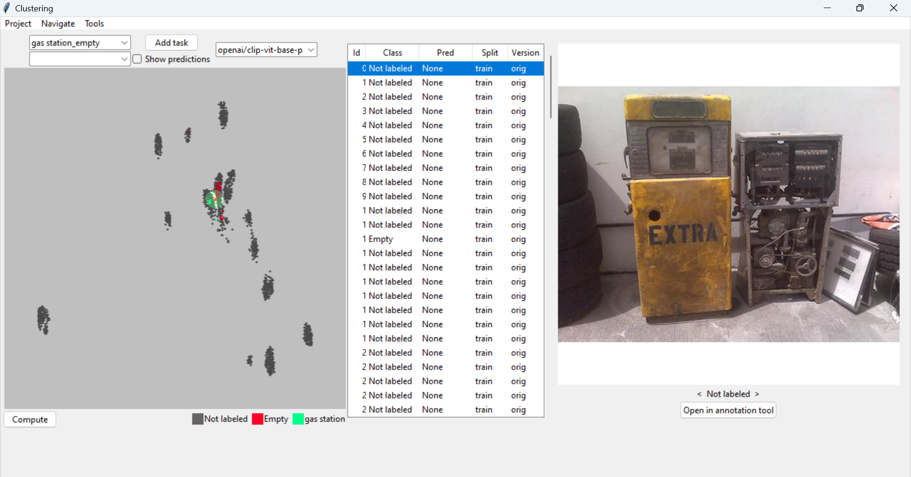
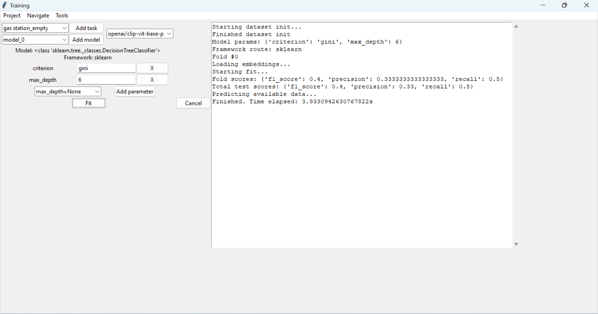

### Image annotation tool (by Mike Tkachuk)

_v1.0.0_

What's new:

*   data exploration tab
*   model head training tab
*   introducing tasks
*   spatial embeddings support
*   augmentations support
*   active learning features and suggestions
*   duplicates search
*   lots of other utilities

### About

Interactive and semi-automated annotation tool. Has support for image-text pairs annotation, tagging, and classification tasks. Leverages pretrained CLIP-like and vision embedders to gain EDA insights and speed up annotation. You can train simple classification heads on top of embedders and explore your model's behaviour.

_Please make sure to export your session at milestones, I will add the import functionality soon. The code works fine in my tests but the data loss is frustrating! All of the CRUD operations call disk sync by design._

Feel free to customize layout, shortcuts, model architectures, etc. All questions, bug reports, and collaborations are welcome in GitHub Issues and Pull Requests!






### Installation and Requirements
(Should work quite stably even with deviations from my setup)  
Was tested on Windows 10/11 with 1920x1080 screen.  
(potentially optional) GPU - 8GB  
```conda env create -f environment.yml```  
Possible syntax errors in python < 3.10  

### Controls and shortcuts
Refer to _Tools -> Info_ in each view.

### Typical use-case step-by-step guide

1.  Do _Project -> Select Folder_ to start your session.
2.  Use annotation UI (main window) to add text labels and tags. Tags are retained for further reuse but can be deleted.
3.  Use _Tools -> Info_ for more details.
4.  In _Project -> Session info_ session stats can be computed.
5.  In _Project -> Manage tasks_ you can add a classification task based on tags retained in step 2. It can be binary or multiclass, multi-select the appropriate tags and mode.
6.  In _Project -> Manage embedder_ you can add Huggingface models by name and from disk. See core.embedding.py for architecture docs.
7.  Precompute embeddings for some number of images with options of your choice. You can also precompute only images that were annotated so far by pressing _Precompute active_.
8.  Navigate to clustering view and run clustering on your selected task using embeddings you just computed.
9.  Click on the plot to explore the data points at that region.
10.  Use _Tools -> Info_ for more details here as well.
11.  With some data sample active you can override its class in the scope of your classification task. Use arrows or numbers to see effect.
12.  Navigate to training view and create a new model for this task. Use one of the predefined templates. You can create new templates from existing models or customize by adding support to your models in _core.model.py_.
13.  Fit your model on your data. You can modify validation split in _Project -> Manage tasks_
14.  Now you can view your predictions in clustering view as well, just select the appropriate model.
15.  If implemented for your model type, press Enter/Ctrl+Enter to show next/previous suggested image to annotate.
16.  **Repeat the model training and annotation until you are satisfied with the performance!**

### Contribution
Feel free to raise issues asking for features/explanations. 
Contributions are also highly welcomed!

#### Future plans:

- export/import full support
- BLIP annotation (did not impress me at first but may be useful at scale and when made tag-informed) 
- support for direct training on images
